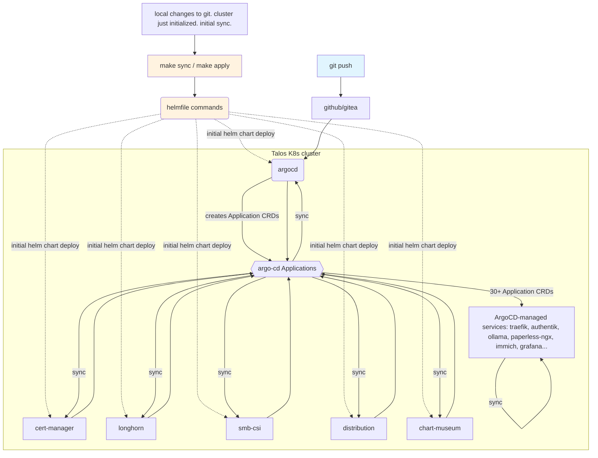

# rpi-talos


My HomeLab Kubernetes cluster on Raspberry Pi (Talos Linux) with ~30 application services managed via ArgoCD.

_Historical setup notes from the original build are archived in [docs/initial-journey-notes.md](docs/initial-journey-notes.md)._

## Hardware

- RPi5 control plane node(s)
- Worker nodes (RPi bare metal, some with NVIDIA GPU, zimaboard)
- Longhorn block storage on worker disks
- Host-level + Misc: NUT UPS, PiSugar, Jellyfin, nginx-proxy-manager, WoLweb
- External: CachyOS llama.cpp LLM (accessible via edge proxy, config not in this repo), Jellyfin, OMV, pi.hole

## Services

| Category | Services |
|---|---|
| Identity | Authentik (SSO), Vault (secrets), Twingate (remote access) |
| Infra | Traefik ingress, cert-manager, Longhorn, SMB CSI, Trivy |
| Media | Immich, Jellyfin, Pinchflat |
| Productivity | Paperless-ngx, Tandoor, BentoPDF |
| AI | CachyOS + llama.cpp + Open WebUI |
| DevOps | Gitea, ChartMuseum, Distribution (registry proxy) |
| Monitoring | Prometheus, Grafana, Headlamp |
| Other | SearXNG, Kiwix, KEDA, Descheduler |

## Domains

All services exposed via Traefik + cert-manager DNS-01 challenges on DuckDNS:

```
rannet.duckdns.org      (internal)
rannet-edge.duckdns.org (edge-accessible)
```

**Only accessible on LAN!**

## Setup Notes/Code

See `talos/README.md` and `Makefile` comments for node bootstrapping. Run `make sync` or `make apply` to deploy all Helm charts via helmfile → ArgoCD.

Tool validation: `make`

## GitOps flow



1. **`make sync/apply`** → helmfile reads `k8s/helmfile.yaml` and deploys platform charts (cert-manager, longhorn, ArgoCD, etc.) directly to the cluster.
2. **ArgoCD chart** (bootstrapped by helmfile) creates two Application CRDs:
   - `argo-cd` — makes ArgoCD manage itself (selfHeal)
   - `cluster-apps` — points to `k8s/helm/cluster-apps/`, which contains ~30 individual Application CRDs, one per service
   - `cluster-apps` also reference helm charts for the services that were initially bootstrapped
3. **ArgoCD continuously reconciles** all nested Applications against git HEAD, self-healing drift and pruning removed resources.

Two tiers: helmfile seeds the platform (especially ArgoCD itself, which needs secrets not tracked in git). ArgoCD takes over ongoing management of everything else from git alone.
